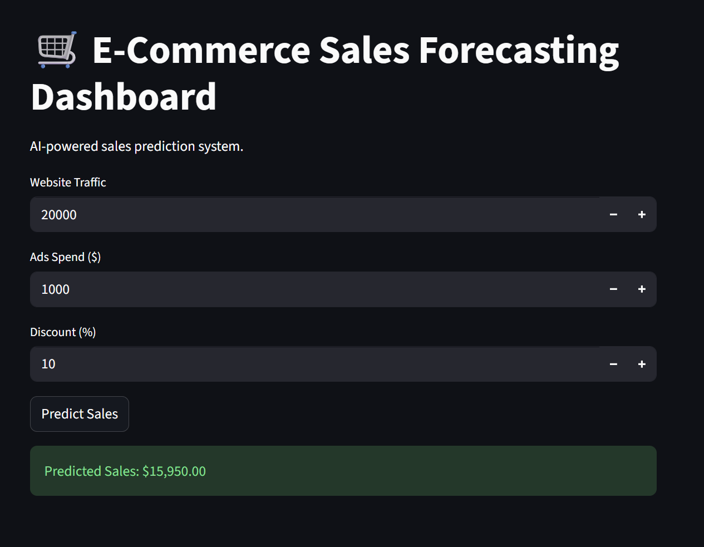
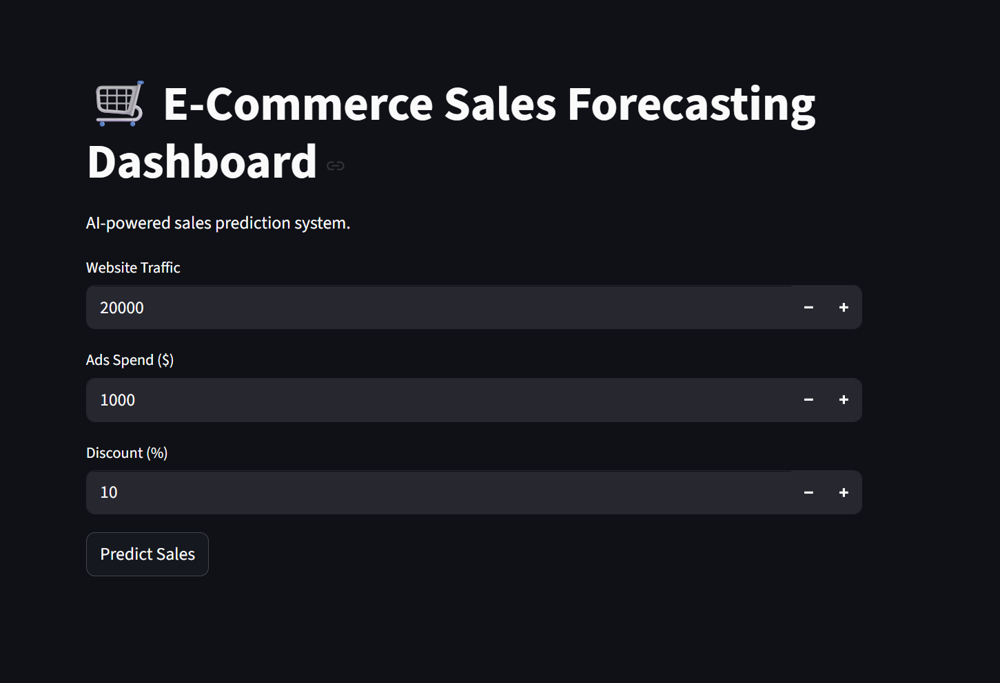
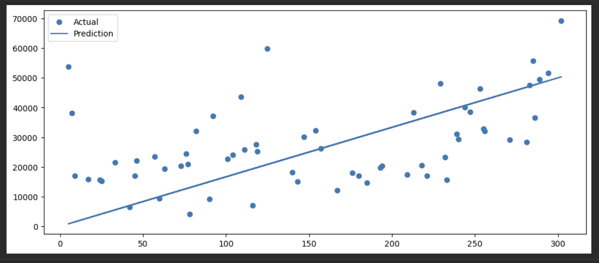
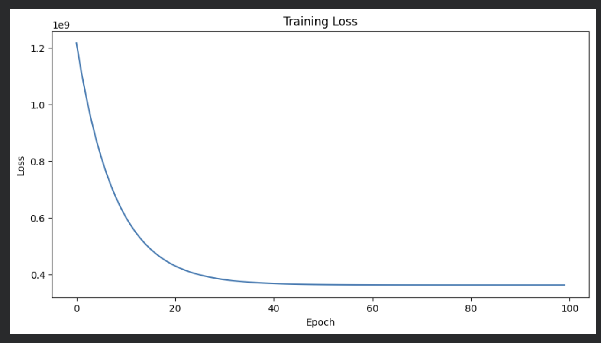
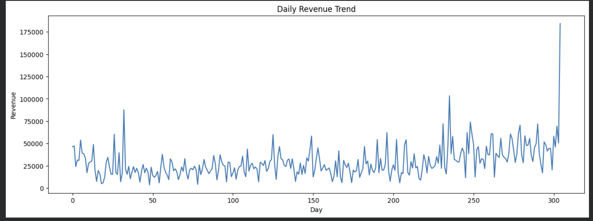
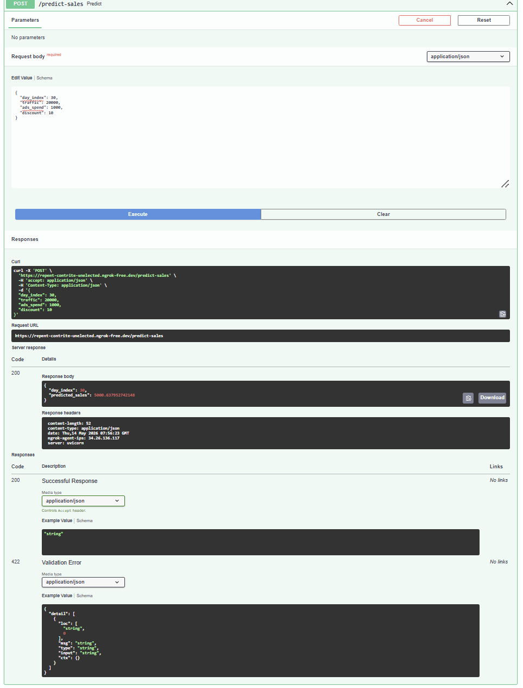
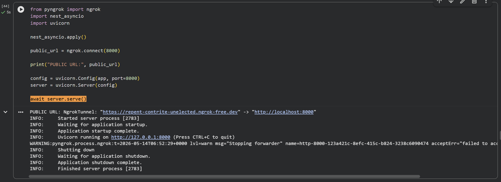

# 🛒 E-Commerce Sales Forecasting System

AI-powered end-to-end sales forecasting platform using Machine Learning, FastAPI, and Streamlit.

---


---

# 📌 Overview

This project simulates a real-world AI system used by modern e-commerce businesses to predict future sales based on:

- Website Traffic
- Advertising Spend
- Promotional Discount Strategy

The system combines:

- Machine Learning
- API Engineering
- Interactive Dashboard Development
- Data Visualization
- Business Analytics

into one production-style AI portfolio project.

---

# 🚀 Live Features

✅ Sales Prediction Dashboard  
✅ Machine Learning Forecasting Model  
✅ FastAPI Backend API  
✅ Interactive Streamlit Frontend  
✅ Swagger API Documentation  
✅ Public Deployment using ngrok  
✅ Real-time Prediction Interface  

---

# 🖥️ Dashboard Preview

## Main Dashboard



---

## Prediction Result Example



---

# 💼 Business Problem

Modern e-commerce companies require accurate sales forecasting systems to support:

- Inventory Planning
- Marketing Budget Allocation
- Revenue Optimization
- Promotional Campaign Planning
- Operational Efficiency

Without forecasting systems, businesses risk:

- Overstock Inventory
- Stock Shortages
- Inefficient Advertising Spend
- Inaccurate Revenue Planning

This project demonstrates how AI and Machine Learning can help businesses make more data-driven operational decisions.

---

# 🎯 Business Impact

This forecasting system can help businesses:

- Estimate future sales performance
- Optimize advertising spending
- Evaluate promotional strategies
- Improve operational planning
- Support strategic decision-making

The workflow reflects practical business use cases commonly found in:

- E-Commerce Companies
- Retail Businesses
- AI Analytics Teams
- Business Intelligence Departments

---

# 🏗️ System Architecture


---

# ⚙️ Tech Stack

## Machine Learning

- Scikit-learn
- Pandas
- NumPy

## Backend

- FastAPI
- Uvicorn

## Frontend

- Streamlit

## Deployment

- ngrok

## Visualization

- Matplotlib
- Seaborn

---

# 📊 Model Performance

## Prediction vs Actual



---

## Training Loss



---

## Revenue Trend Analysis



---

# 🔌 API Documentation

The project includes interactive API documentation using Swagger UI.

## Swagger API Example



---

# 📦 API Example

## Request

```json
POST /predict-sales

{
  "day_index": 30,
  "traffic": 20000,
  "ads_spend": 1000,
  "discount": 10
}
```

## Response

```json
{
  "predicted_sales": 15950
}
```

---

# 🧠 Machine Learning Workflow

The project follows an end-to-end machine learning workflow:

1. Data Collection  
2. Data Cleaning  
3. Feature Engineering  
4. Model Training  
5. Model Evaluation  
6. API Development  
7. Dashboard Development  
8. Deployment & Public Access  

---

# 📁 Project Structure

```text
E-Commerce-Sales-Forecasting/
│
├── app/
├── data/
│   ├── processed/
│   └── raw/
│
├── model/
├── notebooks/
├── screenshots/
├── src/
│
├── app.py
├── requirements.txt
├── LICENSE
└── README.md
```

---

# 🖥️ Server Deployment

The application server was deployed using Streamlit and exposed publicly using ngrok.

## Server Running Example



---

# ⚡ How To Run

## 1. Clone Repository

```bash
git clone https://github.com/yourusername/ecommerce-sales-forecasting.git
```

---

## 2. Install Dependencies

```bash
pip install -r requirements.txt
```

---

## 3. Run FastAPI Backend

```bash
uvicorn app:app --reload
```

---

## 4. Run Streamlit Dashboard

```bash
streamlit run app.py
```

---

## 5. Run ngrok Deployment

```python
from pyngrok import ngrok

public_url = ngrok.connect(8501)

print(public_url)
```

---

# 📈 Key Features

## AI-Powered Forecasting

Uses Machine Learning to estimate future sales based on operational business metrics.

---

## Interactive Dashboard

Provides a user-friendly interface for real-time prediction testing.

---

## Production-Style API

Implements FastAPI backend architecture commonly used in real-world ML systems.

---

## Public Deployment

Allows external access through ngrok public URLs.

---

# 🧪 Engineering Decisions

## Why FastAPI?

FastAPI was selected because it provides:

- Lightweight architecture
- Fast inference performance
- Automatic Swagger documentation
- Production-friendly API development

---

## Why Streamlit?

Streamlit enables:

- Rapid dashboard prototyping
- Interactive UI development
- Quick ML visualization workflows

---

## Why ngrok?

ngrok was used to:

- Expose localhost services publicly
- Test deployment workflows
- Simulate real-world API accessibility

---

# ⚠️ Current Limitations

- Model trained on sample dataset
- Temporary deployment using ngrok
- No authentication system implemented yet
- No cloud infrastructure integration yet

---

# 🔮 Future Improvements

Potential future upgrades include:

- Docker Containerization
- CI/CD Pipeline
- PostgreSQL Integration
- Cloud Deployment (AWS/GCP)
- Model Monitoring
- Real-time Analytics Dashboard
- Advanced Forecasting Algorithms
- MLOps Pipeline Integration

---

# 📚 What I Learned

Through this project, I learned:

- Machine Learning deployment workflows
- API engineering using FastAPI
- Interactive dashboard development
- Public deployment using ngrok
- End-to-end ML system integration
- Business-oriented AI implementation
- Production-style project structuring

---

# 👨‍💻 Author

## Nicolas Gabriel

### GitHub

https://github.com/NzxCode

### LinkedIn

https://www.linkedin.com/

---

# ⭐ Final Notes

This project was built to simulate a real-world AI engineering workflow that combines:

- Machine Learning
- Backend Engineering
- Frontend Dashboard Development
- Deployment Workflows
- Business-Oriented Analytics

into a single end-to-end production-style portfolio project.
