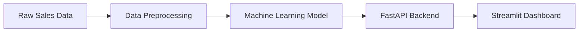

# 🛒 E-Commerce Sales Forecasting System

> AI-powered sales forecasting dashboard using Machine Learning, FastAPI, and Streamlit.

---

# 📌 Masalah

Perusahaan e-commerce sering kesulitan memprediksi penjualan harian secara akurat.

Kesalahan forecasting dapat menyebabkan:
- overstock inventory
- understock produk
- pemborosan budget marketing
- penurunan revenue

Project ini dibuat untuk membantu memprediksi penjualan berdasarkan:
- website traffic
- advertising spend
- discount percentage

---

# 🏗️ Arsitektur



---

# 🛠️ Tech Stack

## Machine Learning
- Python
- Scikit-learn
- Pandas
- NumPy

## Backend
- FastAPI
- Uvicorn

## Frontend
- Streamlit

## Deployment
- Ngrok
- Google Colab

---

# 📊 Dashboard Preview

## Main Dashboard


---

## Prediction Result


---

# 📈 Model Performance

## Prediction vs Actual


---

## Training Loss


---

## Revenue Trend


---

# 🚀 API Documentation

FastAPI Swagger UI:

```bash
/docs
```

---

# 📦 Folder Structure

```bash
ecommerce-sales-forecasting-system/
│
├── app/
├── data/
├── model/
├── notebooks/
├── screenshots/
├── src/
└── README.md
```

---

# ⚡ Cara Menjalankan

## 1. Clone Repository

```bash
git clone https://github.com/NzxCode/ecommerce-sales-forecasting-system.git
```

## 2. Install Dependencies

```bash
pip install -r requirements.txt
```

## 3. Run Streamlit Dashboard

```bash
streamlit run app.py
```

## 4. Run FastAPI

```bash
uvicorn api:app --reload
```

---

# 📌 Business Impact

Dengan forecasting yang lebih akurat:
- perusahaan dapat mengurangi inventory waste
- meningkatkan marketing efficiency
- memprediksi revenue lebih baik
- meningkatkan decision making berbasis data

---

# 📚 Yang Aku Pelajari

Dalam project ini saya belajar:
- membangun end-to-end ML pipeline
- deployment Streamlit di cloud environment
- integrasi FastAPI dengan Machine Learning
- membuat dashboard interaktif
- data visualization untuk business insights

---

# 🔥 Future Improvements

- Deploy ke AWS/GCP
- Gunakan XGBoost untuk akurasi lebih tinggi
- Tambahkan real-time prediction
- Integrasi database PostgreSQL
- CI/CD pipeline dengan GitHub Actions

---

# 👨‍💻 Author

Nicolas Gabriel

GitHub:
https://github.com/NzxCode
